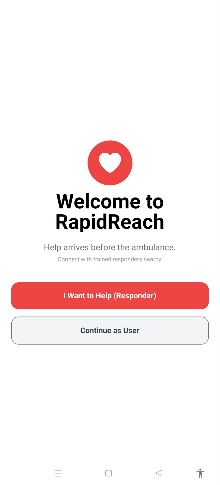
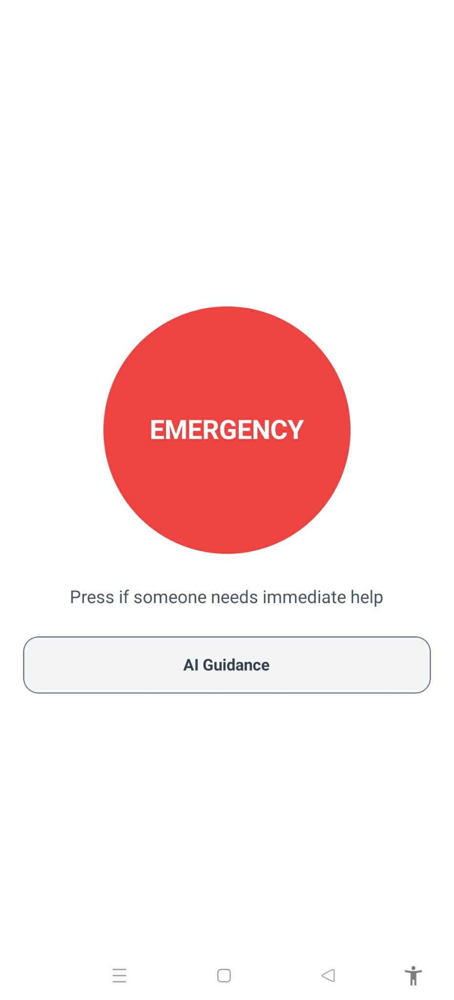
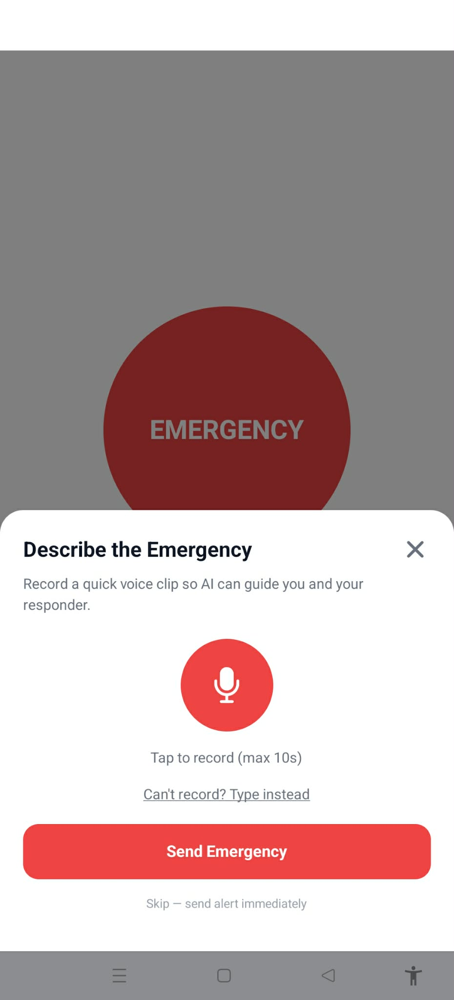
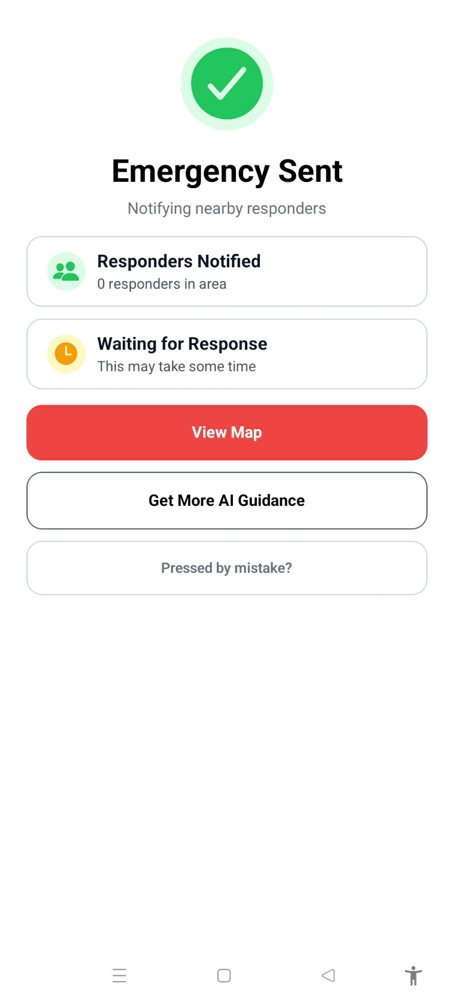
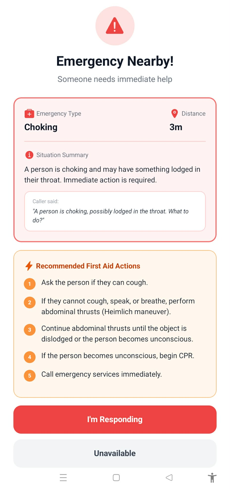
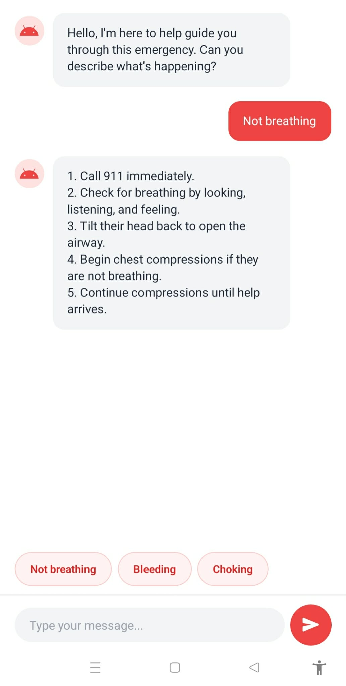

# 🚨 Rapid Reach
### Responders. Faster. Always.

> Built at Kings AI Research Club Hackathon 2026 by **Enakeno Egbevurie, John-Paul Garon, Raashtra K C**

---

## The Problem

In Alberta, the average RCMP emergency response time is **21+ minutes**. The international EMS benchmark is 8 minutes. Brain damage begins in just **3 minutes** without oxygen.

The people physically closest to an emergency — neighbours, off-duty nurses, trained volunteers — have no way to coordinate. No tool connects them. No guidance is given. So most bystanders freeze.

**Rapid Reach fixes that.**

---
## 📱 App Screens

<p align="center">
  
  
  
</p>
<p align="center">
  
  
  
</p>

---

## What It Does

Rapid Reach is a two-sided real-time emergency response app that connects people in crisis with trained first responders nearby — before the ambulance arrives.

**For the person in crisis:**
- Press the emergency button
- Record a 10-second voice clip describing the situation
- AI instantly analyzes the audio, identifies the emergency type, and provides step-by-step first aid instructions on screen

**For nearby responders:**
- Receive an instant alert with AI triage summary, emergency type, and distance
- Navigate to the scene via a live real-time map
- See the caller's exact location with live GPS tracking

---

## Features

| Feature | Description |
|---------|-------------|
| 🎙️ Voice Emergency Analysis | 10-second voice clip sent to Gemini AI for instant triage |
| 🤖 AI First Aid Guidance | Step-by-step instructions for the caller while help is on the way |
| 📍 Live Map Tracking | Real-time location of both caller and responder on a shared map |
| 🔔 Responder Alerts | Nearby responders notified instantly with full AI summary |
| 💬 AI Chat | Ongoing Gemini-powered first aid chat for deeper guidance |
| ⌨️ Text Fallback | Type a description if voice recording isn't possible |

---

## Tech Stack

| Layer | Technology |
|-------|-----------|
| Frontend | React Native, Expo SDK 54, TypeScript |
| Styling | NativeWind (Tailwind CSS) |
| Navigation | Expo Router |
| AI & Voice | Google Gemini API (`gemini-2.5-flash-lite`) |
| Audio Recording | expo-av, expo-file-system |
| Database | Firebase Firestore (real-time) |
| Maps & Location | react-native-maps, expo-location |
| Icons | Expo Vector Icons (Ionicons) |

---

## Getting Started

### Prerequisites
- Node.js
- Expo CLI
- Firebase project with Firestore enabled
- Google Gemini API key

### Installation

```bash
# Clone the repo
git clone https://github.com/your-username/rapid-reach.git
cd rapid-reach

# Install dependencies
npm install

# Install Expo-managed packages
npx expo install expo-av expo-file-system expo-location react-native-maps
```

### Configuration

1. Create a `firebaseConfig.ts` in the root directory:
```ts
import { initializeApp } from 'firebase/app';
import { getFirestore } from 'firebase/firestore';

const firebaseConfig = {
  apiKey: "YOUR_API_KEY",
  authDomain: "YOUR_AUTH_DOMAIN",
  projectId: "YOUR_PROJECT_ID",
  ...
};

const app = initializeApp(firebaseConfig);
export const db = getFirestore(app);
```

2. Add your Gemini API key in `home.tsx` and `chat.tsx`:
```ts
const GEMINI_API = "YOUR_GEMINI_API_KEY";
```

### Run

```bash
npx expo start --clear
```

---

## App Structure

```
app/
├── index.tsx          # Welcome screen — choose caller or responder
├── home.tsx           # Caller home — emergency button + voice modal
├── alert.tsx          # Caller waiting screen — AI guidance + responder status
├── liveLocation.tsx   # Live map — real-time tracking for both sides
├── chat.tsx           # AI first aid chat (Gemini)
├── responderSetup.tsx # Responder registration
├── responderAlert.tsx # Responder alert — AI triage + accept/decline
└── _layout.tsx        # Expo Router layout
```

---

## How It Works

```
Caller speaks → expo-av records audio
     ↓
Audio converted to base64 → sent to Gemini API
     ↓
Gemini returns: emergencyType, summary, actions[], transcript
     ↓
Written to Firebase Firestore (emergencies/current)
     ↓
Responder device picks up real-time snapshot
     ↓
Responder accepts → live GPS sync begins
     ↓
Both sides see each other on the map
```

---

## What's Next

- 🌐 Multi-language support
- 🔔 Push notifications when app is backgrounded
- ✅ Verified responder credentials
- 🏥 AI-automated 911 dispatch call with location + voice summary
- 📲 Arrival notification for the caller

---

> *"Because the first five minutes save lives."*
